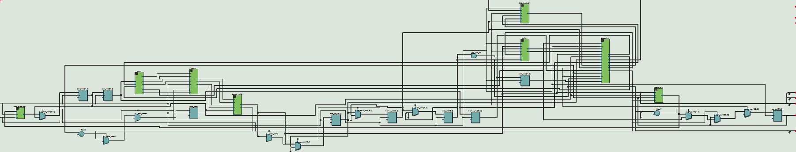
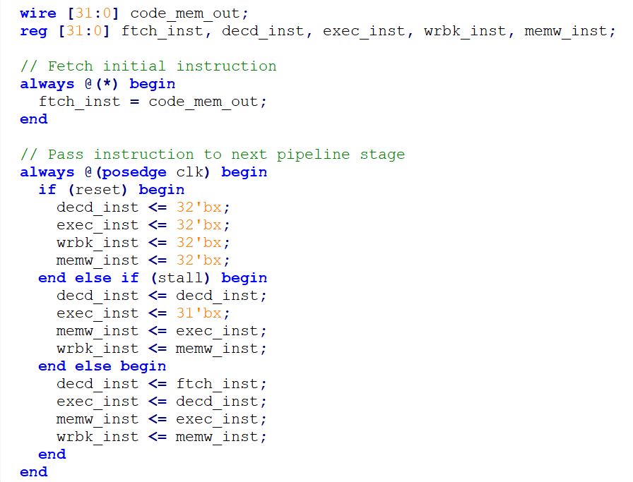
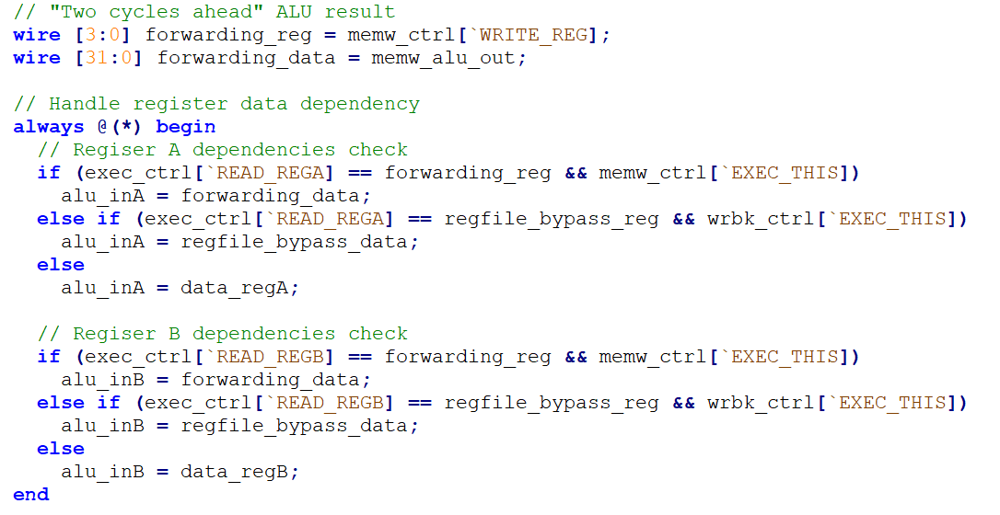
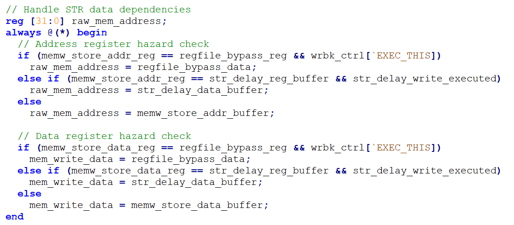
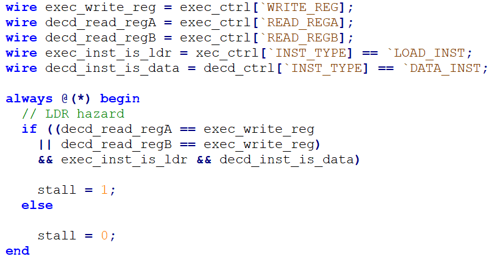
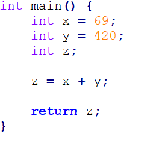
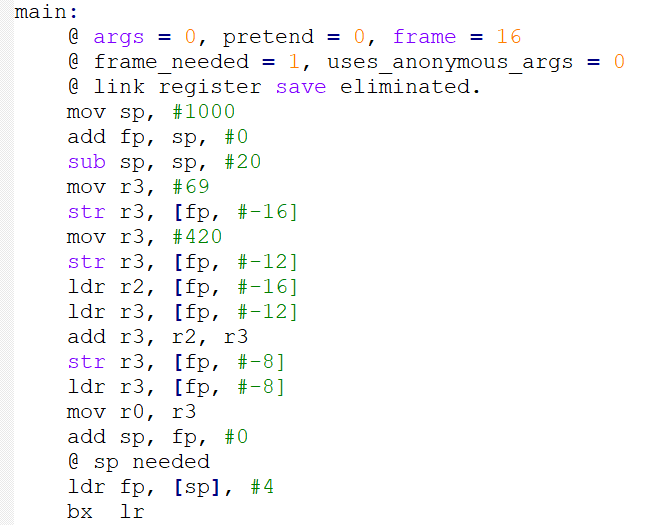
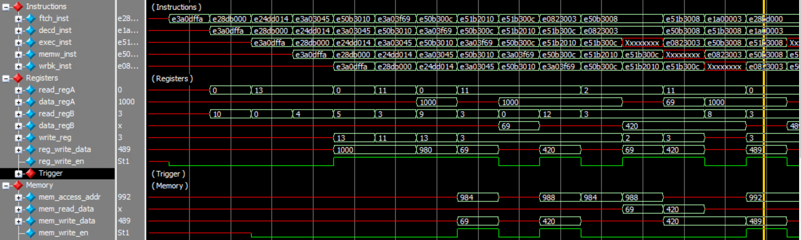
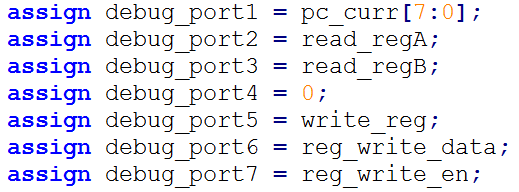
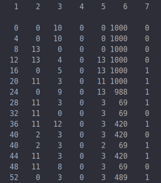

iProcess
======
#### By Charlie Merth and Anabel Mathieson

Design
======

This is a 5-Stage Pipelined ARM 32-bit Processor written in Verilog. The overall design of the processor utilizes the following files (located in iProcess/cpu/):

| File            | Description                                                      |
|-----------------|------------------------------------------------------------------|
| alu.v           | Combinational logic for arithmetic operations                    |
| arm_constants.v | Verilog preprocessor macros                                      |
| code.hex        | Raw ARM instructions machine code                                |
| code_mem.v      | Memory block module for storing instructions                     |
| cpsr.v          | Handles Current Program Status Register logic                    |
| cpu_tb.v        | Main testbench for cpu.v                                         |
| data_mem.v      | Memory block module for storing program data                     |
| datapath.v      | Handles the flow of data through the cpu, including data hazards |
| decode_inst.v   | Decodes a given instruction, outputting control data             |
| regfile.v       | ARM 32-bit register file                                         |
| update_pc.v     | Calculates the program counter                                   |
| wave.do         | ModelSim macro file for loading the wave view                    |

**Figure 1: A list of files in our CPU design.**



**Figure 2: Structural block design of our CPU (via Quartus Prime RTL Viewer).**

Pipelining
----------

In our design, wires and registers that correspond to a particular stage of the pipeline are prefixed by a four letter mnemonic:

ftch\_xxx: Instruction fetch stage
decd\_xxx: Instruction decode stage
exec\_xxx: ALU execute stage
wrbk\_xxx: Memory read/write stage
memw\_xxx: Register writeback stage

This keeps all of the signals well organized. We achieved pipelining simply by using registers and passing sequential instructions (as well as some pertinent control signals) at each clock cycle. Figure 3 shows instruction pipelining in our top-level module.



**Figure 3: Instruction pipelining logic in cpu.v module.**

Hazards
=======

As there are several different types of hazards, there were several steps needed to resolve each one. They are summarized below.

Structural Hazard
-----------------

These types of hazards were avoided by maintaining a strict ordering of execution of instructions. Essentially, we would force instructions which read and write to memory to *always* occur during the “memory” pipeline stage. Similarly, we make sure reads and writes to the register file *always* occur during the “register read” and “register write” pipeline stages (respectively). Since each instruction has a lifetime of 5 clock cycles in the pipeline, these structural hazards can be avoided[^1].

Data Hazard
-----------

There are several distinct types of data hazards. There are four main types that our CPU can detect and handle. The following section describes examples of such data hazards and the solutions we used to manage them.

### 1. Data Read After Data Write

This is best illustrated by a simple example below.

```
add r0, r1, r3
add r2, r0, r1
```

**Figure 4: Example of “data read after data write” hazard.**

The key issue here is that data is “requested” two cycles before the updated value is written to memory. We fixed this by including **register forwarding** logic to detect this contingency.



**Figure 5: Implementation of Register Forwarding.**

There is similar logic (not shown) for memory access registers.

### 2. Delayed Data Read After Data Write

This case is similar to the previous section, except that there is an extra instruction in between the conflicting instructions. The code below shows an example.

```
add r0, r1, r3
sub r9, r10, r11 @ "dummy" instruction
add r2, r0, r1
```

**Figure 6: Example of “delayed data read after data write”.**

Here, the second add instruction occurs *two* instructions after the first add instruction. The first add instruction still hasn’t written to the register file at the moment when the second add instruction needs to use the result (stored in r0), thus it is a data hazard. The solution we implemented is **regfile bypassing**.

### 3. Store Delay Buffer

This is a memory-specific data hazard that was encountered in our test code. A minimal example is presented below.

```
add r11, r13, #0
str r3, [r11]
```

**Figure 7: STR requests data modified by preceding instruction.**

Here, the store instruction wants to write to the address stored at r11, but that data is changed after the register file reads r11. Therefore we implemented another buffer that checks for these types of hazards (shown below).



**Figure 8: Logic for preventing accesses to erroneous memory addresses.**

### 4. Data Read After Load

The primary situation where this occurs is when a data instruction uses a register value immediately after a load instruction that writes to the same register. An example is shown below.

```
ldr r0, [r11, #0]
sub r3, r0, r4 @ Can't solve as needed data isn't available

and r5, r0, r6 @ Fixed by forwarding
orr r7, r0, r8 @ Fixed by register file bypass
```

**Figure 9: LDR writes to register that is needed for a trailing data instruction.**

In this case, the load instruction writes the memory data in the “writeback” stage, while the subtract instruction needs the data in its “execute” stage. This is equivalent to a three-cycle timing mismatch. This data hazard requires a **pipeline stall**, as there is no other way for the subtract instruction to receive the most recent data.



**Figure 10: Logic in datapath.v for detecting “data read after load”.**

The logic for detecting when to stall is shown in Figure 10. Figure 3 shows how the stall flag is used in the top-level module.[^2]

Results
=======

To test our CPU, we wrote programs in C, then compiled them into assembly using an ARM32 cross-compiler (arm-none-eabi-gcc -S &lt;file.c&gt;). Some manual work was then done to extract the particular hex machine code.

We first tested a simple program written in C that initializes several variables and adds them together, storing the result in another variable. The code is shown in Figure 11.




**Figure 11: Test file add.c and gcc’s ARM32 assembly output.**!

Simulation
----------

Shown below are the simulation results on our processor.



**Figure 12: ModelSim results of running add.c on our processor.**

The simplest way to verify that this code is correctly executed on our CPU is to look at write\_reg, reg\_write\_data, and reg\_write\_en[^3] (near the bottom of the “Registers” group) in Figure 12. At every cycle where a write to a register occurs, the target register and write values are the same as expected from the assembly code (in Figure X). For example, the yellow cursor highlights the specific instance where the C file’s addition `z = x + y` is being written to the register file. In addition, we can look at the “Memory” signals and verify that the values being read from and written to the memory are as expected.

Hardware
--------

In order to monitor how the program executes on our device, we mapped certain signals to external debug ports. Figure 13 shows the signals that are distributed across all 7 of them.



**Figure 13: Debug port definitions in top-level module.**

Finally, after synthesizing the logic onto our FPGA, we monitored output using debug\_console.py. I wrote a simple Python script to change the output from hexadecimal into decimal representation. The relevant section of results as in Figure 12 are shown below.



**Figure 14: Results of uploading add.c to the TinyFPGA BX.**

The things to note in these results are the same as in the simulation. Column 1 shows the program counter, which starts at zero and increments by 4 each cycle. Column 2 and 3 show read register A and register B (respectively) in the decode stage. Column 5, 6, and 7 show the write register, write value, and write enable signals. Note how these exactly match the simulation output.

Notes
=====

In order to use this processor on any machine with any arbitrary code, simply open arm\_constants.v and edit the line:

```
#define CODE_DATA “<your file here>”
```

to store the absolute path of an ARM32 machine code hex file (relative paths do not seem to work very well). The wave.do file is already pre-configured to display relevant program state when run in ModelSim.

---

> **1:** A consequence of this is that a LDR instruction with pre/post-index register writeback necessarily takes more than the five pipeline stages to fully execute. We have not implemented such functionality.
>
> **2:** It’s worth noting that after the pipeline stall, the data is now in a different (but more benign) data hazard: a “data read after data write” situation. Luckily, the register forwarding logic discussed above will automatically resolve this.
>
> **3:** write\_reg = which register is being written to  
>    reg\_write\_data = what value to write to the register  
>    reg\_write\_en = enable write to registers  
